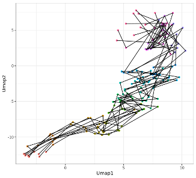

# CellST

An innovative machine-learning framework called Cell Smoothing Transformation (CellST) to elucidate the dynamic cell fate paths and construct gene networks in cell differentiation processes.

## Installation

Please Note: 
The CombMSC is required but the package is archieved on Cran. Please downloaded the package from this link (https://cran.r-project.org/src/contrib/Archive/CombMSC/) and install using the following command:

```
R CMD INSTALL CombMSC_1.4.2.1.tar.gz
```

Create Conda enviroment
Note that users need to set up a conda environment with package "pot" installed before using this function.

To create conda enviroment:
```
conda create -n ot python=3.9
pip install pot

```

Install CellST
```
library(devtools)
install_github("zhanzmr/CellST")
```

## Usage

cell_name_traj() accomplishes a cell lineage tracing method, which aligns two individual cells between any two adjacent time points via the optimal transport technique(Earth mover's distance is used in this function), and returns unique trajectories for individual cells.

```
library(readr)
test_data <- read_csv("test_data.csv")
test_data <- data.frame(test_data, row.names = 1)
cell_traj <- cell_name_traj(test_data)
```

trajectory_expression() returns a list containing gene expression of each cell lineage trajectory.
```
traj_express <- trajectory_expression(test_data, cell_traj)
```

smooth_cell_expression() returns smoothing gene expression patterns for individual cells by smoothing spline models. SSANOVA is used in this package.

```
total_pred <- smooth_cell_expression(traj_express,npred=300)
```

gene_expression() returns individual gene expression across cell lineages trajectories.
```
gene_express <- gene_expression(traj_express)
```

Plot cell lineage figures
```
all_umap <- read_csv("all_umap.csv")
gra = plot_linked_traj(all_umap,cell_name_traj,t0=NULL,ntraj=10,random_seed=2022)
```


align_cell_time() normalizes the time line since different cells need different time in the differentiate process.

```
biotime = align_cell_time(trajectory_expression)
```


